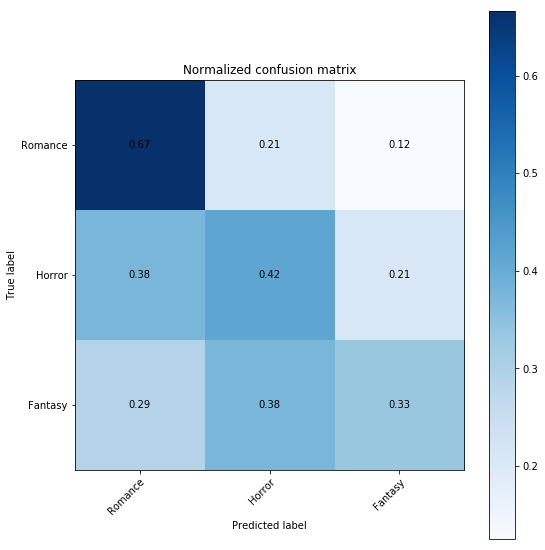

# Movie-scripts-classifier

## Purpose and Data
Determining what genre a movie is based on its script.
Web-scraped scripts of movies from 3 different genres.
- Romance
- Horror
- Fantasy
These genres were chosen because we deemed them to have the least overlap.
In total, we had 116 scripts from each genre, with an average of 23221 words per script.

## Data Preprocessing
We created our list of stopwords by including:
- Standard english stopwords from nltk.corpus.stopwords
- Names from nltk.corpus.names
- Punctuation marks and special characters
- Digits
- Lemmatized our remaining words using WordNetLemmatizer from NLTK.
- Lemmatizer needed to be given the part of speech for the words to be correctly lemmatized.

## Feature Engineering
Created frequency distribution tables for the scripts.
Stored data on all scripts in a single DataFrame.
This DataFrame had 348 movies with 55948 unique words.
To combat sparsity, we decided to cut out words that have only appeared in a single script out of all our movie.
This cut down the number of features to 27799.
We tried being even more selective with our words by adjusting the minimum number of movies they must appear in, but this ended up removing too many words.

|Number of movies |  Words left |
|-----------------|-------------|
|2+               |   27799     |
|3+               |   12435     |
|4+               |   11209     |
|5+               |   10251     |
|6+               |   9483      |
|7+               |   8823      |
|10+              |   8308      |
|15+              |   6476      |

Then we went through each word and only kept the words that were in the top 25 most frequent of a movie.
This ended up cutting down our number of features down to 1220.

## Modeling
All of our models were trained on 80% of our data and verified on the remaining 20%.
All models were also tuned using GridSearchCV.

### Random Forest:

### Multinomial Naive Bayes:

### XGBoost:

Key:
- RF: Random Forest
- MNB: Multinomial Naive Bayes
- XGB: XGBoost
- v: vanilla
- g: grid search optimized

|Model          |Accuracy       |Precision       |Recall         |F1 Score       |
|---------------|---------------|----------------|---------------|---------------|
|RF v           | 0.56          |  0.57          |  0.57         | 0.55          |
|RF g           | 0.63          |  0.63          |  0.62         | 0.62          |
|RF TF-IDF v    | 0.54          |  0.53          |  0.54         | 0.54          |
|RF TF-IDF g    | 0.58          |  0.60          |  0.58         | 0.58          |
|**MNB v**      |**0.65**       |**0.69**        |**0.65**       |**0.64**       |
|**MNB g**      |**0.65**       |**0.69**        |**0.65**       |**0.64**       |
|MNB TF-IDF v   | 0.54          |  0.51          |  0.54         | 0.48          |
|MNB TF-IDF g   | 0.47          |  0.47          |  0.47         | 0.46          |
|XGBoost v      | 0.64          |  0.63          |  0.64         | 0.63          |
|XGBoost g      | 0.63          |  0.63          |  0.63         | 0.62          |

## Final Model
Fantasy scripts were misclassified the most because fantasy could include romantic scenes and mystical creatures.
