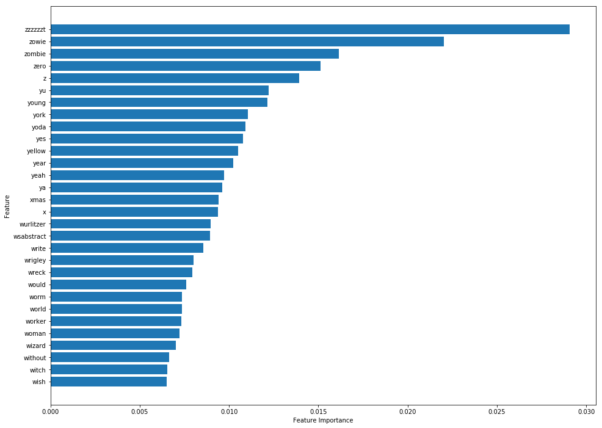
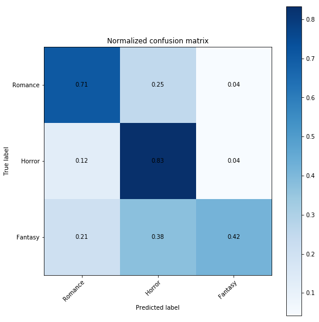

# Movie-scripts-classifier

## Purpose and Data
Determining what genre a movie is based on its script.
Web-scraped scripts of movies from 3 different genres.
- Romance
- Horror
- Fantasy
These were chosen because it was deemed they would have the least overlap.
In total, we had 116 scripts from each genre, with an average of 23221 words per script.

## Data Preprocessing
The following steps were taken to pre-process the data.
- Compiling a list of stop words to be taken out of each script:
  - Standard english stopwords from nltk.corpus.stopwords.
  - Names from nltk.corpus.names.
  - Punctuation marks and special characters.
  - Digits.
- Lemmatized the remaining words using WordNetLemmatizer from NLTK.

## Feature Engineering
First step was to create tokenized word frequency distribution tables for the scripts. These were stored in a single DataFrame which in the end comprised of 348 movies with 55948 unique words.
To lower the sparsity of the resulting matrix, words that have only appeared in a single script out of all our movie were cut down from the DataFrame- this cut down the number of features to 27799. Table below shows how many features would have been cut down if the criteria was altered to 3, 4 etc...

|Number of movies |  Words left |
|-----------------|-------------|
|2+               |   27799     |
|3+               |   12435     |
|4+               |   11209     |
|5+               |   10251     |
|6+               |   9483      |
|7+               |   8823      |
|10+              |   8308      |
|15+              |   6476      |

The DataFrame was then was further filtered in order to keep the words that were in the top 25 most frequent for a movie.
This ended up cut down the number of features down to 1220.

## Modeling
This is a classification problem as such, Random Forest, Multinomial Naive Bayes and XGBoost were chosen as potential models to fit the data. All of our models were trained on 80% of our data and verified on the remaining 20%.
They were also models tuned using GridSearchCV library.

### Random Forest:

### Multinomial Naive Bayes:

### XGBoost:

#### Model table summary
Key:
- RF: Random Forest
- MNB: Multinomial Naive Bayes
- XGB: XGBoost
- v: vanilla
- g: grid search optimized

|Model          |Accuracy       |Precision       |Recall         |F1 Score       |
|---------------|---------------|----------------|---------------|---------------|
|RF v           | 0.56          |  0.57          |  0.57         | 0.55          |
|RF g           | 0.63          |  0.63          |  0.62         | 0.62          |
|RF TF-IDF v    | 0.54          |  0.53          |  0.54         | 0.54          |
|RF TF-IDF g    | 0.58          |  0.60          |  0.58         | 0.58          |
|**MNB v**      |**0.65**       |**0.69**        |**0.65**       |**0.64**       |
|**MNB g**      |**0.65**       |**0.69**        |**0.65**       |**0.64**       |
|MNB TF-IDF v   | 0.54          |  0.51          |  0.54         | 0.48          |
|MNB TF-IDF g   | 0.47          |  0.47          |  0.47         | 0.46          |
|XGBoost v      | 0.64          |  0.63          |  0.64         | 0.63          |
|XGBoost g      | 0.63          |  0.63          |  0.63         | 0.62          |

## The Final Chosen Model
As seen from the table above, the best results were obtained from Multinomial Naive Bayes- there are a two parametes to tune which lead to the results of the Vanilla and optimized model to perform the same. Fantasy scripts were misclassified the most due to the fact that fantasy could include romantic scenes and mystical creatures and both Romance and Horror could be sub-genres of movie that is mainly a fantasy.The model can be further enhanced be using more scripts hence allowing more feartures to classify on.

